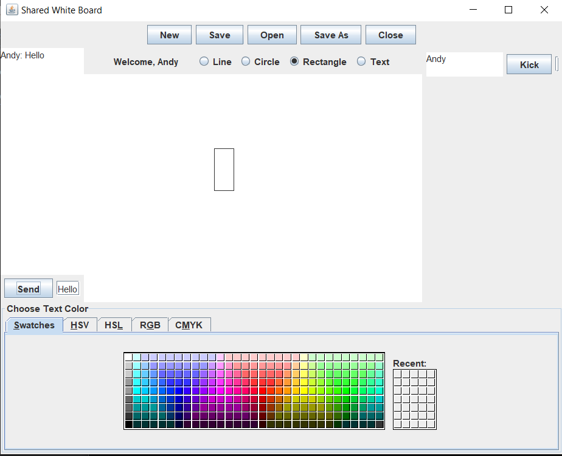

# COMP90015 Assingment 2 - Shared Whiteboard

## Introduction

This is a university assignment for Distributed Systems subject. The core idea of the project is to simulate a shared whiteboard app thatcreate that allows users to create a whiteboard or join someone else's whiteboard. This project adopts Java RMI framework. 



## Core Functionalities
- Create a whiteboard at certain ip address
- Join other's whiteboard
- Manage the whiteboard you have created, including approving user join and kicking malicious users
- Draw simple shapes such as lines, rectangles, as well as input text
- Save the current board to local, and open local files to display on the board
- Live chat

## Start
Clone this repository, open with intelliJ and export make production, export Server, CreateWhiteBoard and JoinWhiteBoard as .jar file

### Start RMI Registry
1. cd current directory to the out folder after production <br>
```cd out/production/a2```

2. start the registry <br>
```start rmiregistry```

3. On another terminal window, go to the directory where it holds the exported .jar files e.g.<br>
```cd desktop/demo``` <br>
```ls``` <br>
Output: <br>
```Server.jar CreateWhiteBoard.jar JoinWhiteBoard.jar```

4. Start the main server: <br>
```java -Djava.rmi.server.codebase=file:"<YOUR PATH TO FILE>\a2\out" -jar Server.jar```

5. Open another terminal window, go to the same directory as above, and create a whiteboard: <br>
```java -Djava.rmi.server.codebase=file:"<YOUR PATH TO FILE>a2\out" -jar CreateWhiteBoard.jar localhost <PORT NUMBER> <ANY USER NAME>```

6. To join the opened whiteboard, simply open another window and go to the same directory: <br>
```java -Djava.rmi.server.codebase=file:"<YOUR PATH TO FILE>\a2\out" -jar JoinWhiteBoard.jar localhost <PORT NUMBER> <USER NAME>```


## Future improvements
- Add more artistic features to the UI, the current interface is overly simplified and it's hard to find the input text box

- Generalise the project so that there is an interface for users to create/join the whiteboard, without having to type in command lines. 


